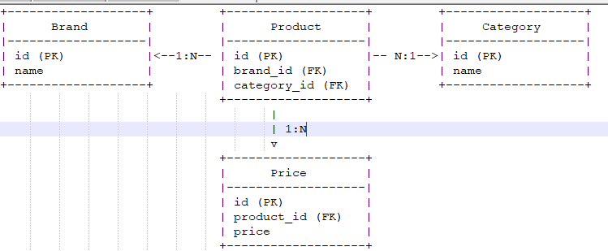

Brand ⇄ Product (1:N 관계):

하나의 브랜드 (Brand)는 여러 개의 상품 (Product)을 가질 수 있습니다.
Product는 brand_id 외래 키를 통해 Brand와 연결됩니다.
Product ⇄ Category (N:1 관계):

하나의 상품 (Product)은 하나의 카테고리 (Category)에 속합니다.
Product는 category_id 외래 키를 통해 Category와 연결됩니다.
Product ⇄ Price (1:N 관계):

하나의 상품 (Product)은 여러 개의 가격 (Price)을 가질 수 있습니다.
Price는 product_id 외래 키를 통해 Product와 연결됩니다.

중간 테이블로서 Product 역할
**Product**는 **Brand**와 Category 사이에서 중간 테이블 역할을 합니다.
즉, **Product**는 각각 **Brand**와 **Category**를 외래 키로 참조하여,
**Brand**와 Category 간의 다대일 관계를 연결합니다.

